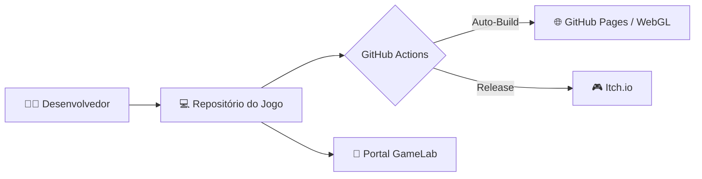

## 🏗️ Arquitetura do GameLab

Voltar para:

- [Engenharia](./engenharia.md)

> Visão sistêmica da infraestrutura de desenvolvimento do laboratório.

## 1. Visão Geral do Ecossistema

O GameLab opera em um fluxo descentralizado, onde o código vive no GitHub, a vitrine de distribuição vive no Itch.io e a documentação central (este portal) atua como a "Single Source of Truth".

---

## 2. Padrão de Integração de Projetos

Para manter a escalabilidade, todo novo projeto dentro da organização **deve** seguir a estrutura de diretórios baseada em funcionalidades (*Feature-based*) para evitar colisões entre as equipes:

- **Core:** Sistemas de baixo nível e Autoloads globais.
- **Entities:** Subpastas para cada personagem/inimigo (contendo `.tscn`, `.gd` e assets locais).
- **Systems:** Lógica de negócio pura (ex: `HealthSystem`, `SaveSystem`).
- **Assets:** Recursos compartilhados (fontes, estilos, áudio ambiente).

---

## 3. Fluxo de Dados e Versionamento (Git Flow)

Utilizamos uma abordagem de *Feature Branching*.

1. **Main/Master:** Estável e pronta para publicação (Gold).
2. **Develop:** Branch de integração para estabilização de *builds* semanais.
3. **Feature/Fix Branches:** Onde o trabalho diário ocorre.

> **Importante:** Todo `Pull Request` deve passar obrigatoriamente pela validação de qualidade (Linting + Unit Tests) definida no arquivo `.github/workflows/godot_pr_check.yml` presente no repositório de cada jogo.

---

## 4. Estratégia de Documentação

A arquitetura de conhecimento do GameLab é baseada em três pilares:

| Tipo | Localização | Objetivo |
| --- | --- | --- |
| **Documentação de Código** | `@export` + `##` | Auxiliar o Designer no Inspector da Godot. |
| **Documentação Técnica** | `docs/TECH_STACK.md` | Detalhar a stack técnica, shaders e plugins. |
| **Documentação de Processos** | `dox/` | Diretrizes, on-boarding e cultura do laboratório. |

---

## 5. Padrões Técnicos Recomendados

- **Engine:** Godot 4.x (versão LTS recomendada).
- **Linguagem:** GDScript (Tipagem estática obrigatória).
- **Arquitetura de Nós:** "Call Down, Signal Up".
- **Componentização:** Preferência por `Nodes` modulares em vez de herança complexa de classes.

---

## 6. Pipeline de CI/CD (Automação)

O laboratório automatiza o que é repetitivo para focar no que é criativo:

1. **Linter:** `gdscript-toolkit` garante que o padrão de estilo seja mantido.
2. **Unit Testing:** `GUT` (Godot Unit Test) valida mecânicas críticas.
3. **Deploy:** GitHub Actions publica automaticamente versões Web para o GitHub Pages (para teste interno) e o time manualmente sobe a versão final para o Itch.io.
