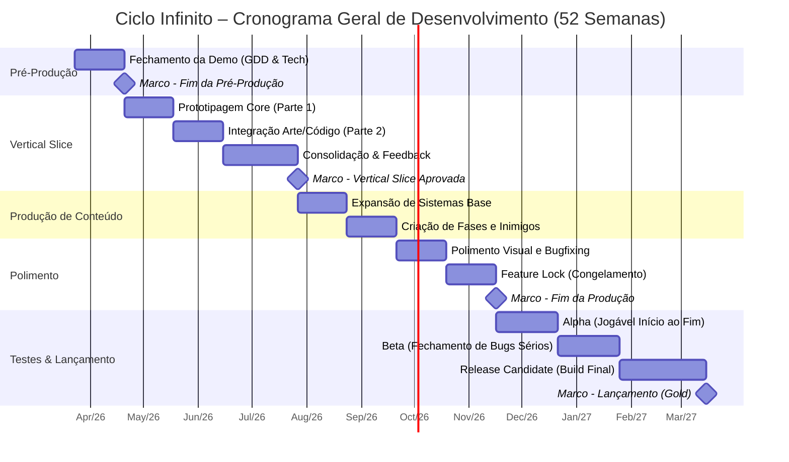

## 📅 Calendário de Entregas: Ciclo Infinito

Voltar para:

- [Projetos](./projetos.md)

> Visão macro do cronograma de desenvolvimento do projeto ao longo de 52 semanas. As datas e os marcos de entrega (Milestones) guiam as metas de cada Squad.

---

## 🎯 Definição dos Grandes Marcos (Milestones)

Para manter o escopo sob controle, a equipe de Coordenação avalia o sucesso do projeto com base nas seguintes entregas estruturais:

- **♦️ Fim da Pré-Produção:** O Game Design Document (GDD) está consolidado, a arquitetura técnica foi definida e a equipe entende claramente o que precisa ser construído.
- **♦️ Vertical Slice Aprovada:** O momento mais importante do projeto. Temos um trecho de *gameplay* totalmente polido (com arte final, som e mecânicas completas) que representa a visão final do jogo. Se a Vertical Slice for divertida, o jogo inteiro será.
- **♦️ Fim da Produção (Feature Lock):** A partir desta data, **nenhuma funcionalidade, mecânica ou asset novo entra no jogo**. A equipe de Design e Arte não cria coisas novas, e a equipe de Programação se dedica 100% à correção de bugs e performance.
- **♦️ Lançamento (Gold):** O jogo está estável, polido e pronto para ser publicado no nosso itch.io oficial.
