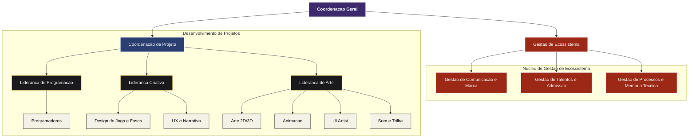

## Organograma do GameLab

Voltar para:

- [Governanca](./governanca.md)

Esta pagina apresenta a estrutura organizacional do laboratorio para consulta rapida.

- [Exibir no viewer do Github](https://github.com/brenoASantana/gamelab-portal/blob/main/docs/organograma.mmd)
