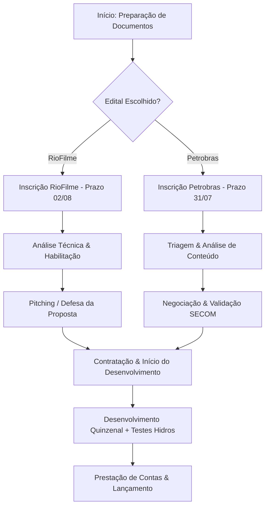

# Planejamento: Edital RioFilme & Petrobras 2026

**Projeto:** Loot and Lunch (MVP & Produção)
**Objetivo:** Captar recursos via fomento público para desenvolvimento e expansão.

## 1. Cronograma de Entregas (Proposta Quinzenal)

Para garantir a cadência exigida e o controle do MVP:

| Sprint | Foco | Entrega de Destaque |
| --- | --- | --- |
| **Q1** | Documentação & Setup | Envio do Cadastro/Habilitação (RioFilme) |
| **Q2** | MVP - Design & Prototipagem | Prototipagem funcional (Core Loop) |
| **Q3** | MVP - Testes (Hidros) | Relatório de Feedback dos Beta Testers |
| **Q4** | Refinamento & Pitch | Apresentação do Pitching finalizado |

---

## 2. Diagrama de Fluxo de Execução

Este diagrama ajuda a equipe a visualizar como passamos da inscrição até a entrega final.

---

## 3. Checklist de Ação Imediata (Pós-Reunião)

### Para o Gamelab (Execução):

* [ ] **Nome do Jogo:** Avaliar se "Loot and Lunch" pode ser interpretado como *loot box* (vedado pela RioFilme). *Sugestão: Criar um nome alternativo para a submissão.*
* [ ] **CNAE:** Confirmar se o CNPJ da produtora possui um dos CNAEs exigidos (ex: 6201-5).
* [ ] **Documentação:** Reunir certidões de regularidade fiscal e trabalhista (urgente para ambas as leis).
* [ ] **Política Afirmativa:** Identificar sócios/diretores que se enquadram nas categorias (negros, mulheres, PCDs, etc) para pontuação bônus.

### Para a Equipe Hidros (Beta Testers):

* [ ] **Termo de Parceria:** Definir como será a coleta de feedbacks (questionários, diário de testes).
* [ ] **Ambiente de Teste:** Disponibilizar o build do MVP quinzenalmente para a equipe.

---

## 4. Estratégia de Pitch

O professor e a banca avaliarão com foco em:

1. **Brasilidade:** (Obrigatório na Petrobras).
2. **Exequibilidade:** O plano quinzenal mostra que não é apenas uma ideia, mas um projeto executável.
3. **Potencial de Negócio:** Como o jogo se sustenta após o fim do aporte? (Estratégia de Marketing e Vendas).

---

**Dica para a apresentação:**
Ao apresentar ao professor, destaque que a **Hidros** não é apenas um testador, mas um parceiro estratégico que garante a **validação técnica constante** do produto, o que aumenta muito a nota de "Exequibilidade" nos editais.
